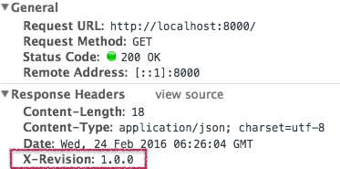

# gin-revision-middleware

Revision middleware for Gin framework written in Go (Golang).

[](https://travis-ci.org/appleboy/gin-revision-middleware) [](https://drone.io/github.com/appleboy/gin-revision-middleware/latest) [](https://goreportcard.com/report/github.com/appleboy/gin-revision-middleware) [](https://coveralls.io/github/appleboy/gin-revision-middleware?branch=master) [](https://codecov.io/gh/appleboy/gin-revision-middleware)

## How to use

Please see the [demo](example/main.go) code and creat `REVISION` file and write your application version into file.

```go
package main

import (
  "github.com/appleboy/gin-revision-middleware"
  "github.com/gin-gonic/gin"
  "net/http"
  "os"
)

func rootHandler(context *gin.Context) {
  context.JSON(http.StatusOK, gin.H{
    "Hello": "world",
  })
}

func main() {
  port := os.Getenv("PORT")
  router := gin.Default()
  if port == "" {
    port = "8000"
  }
  router.Use(revision.Middleware())
  router.GET("/", rootHandler)
  router.Run(":" + port)
}
```

Screenshot for header




